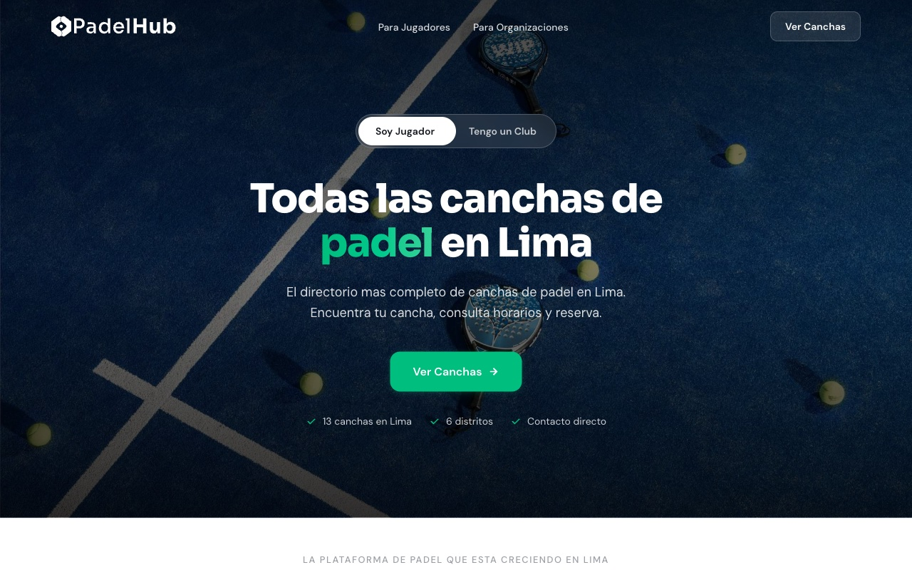
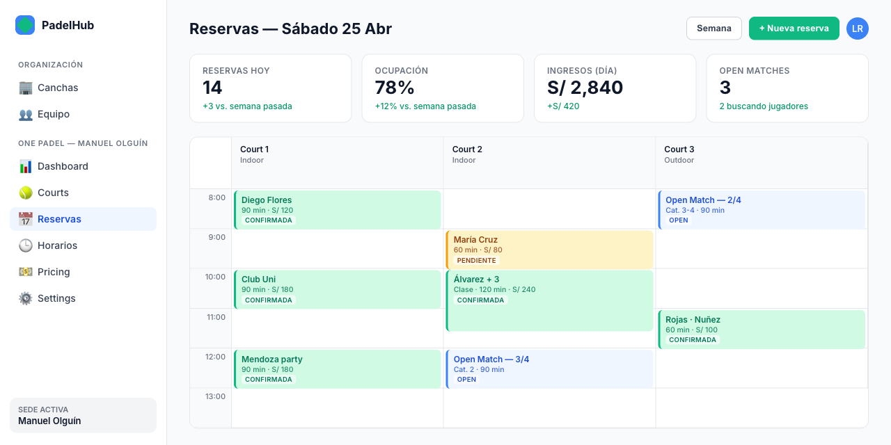
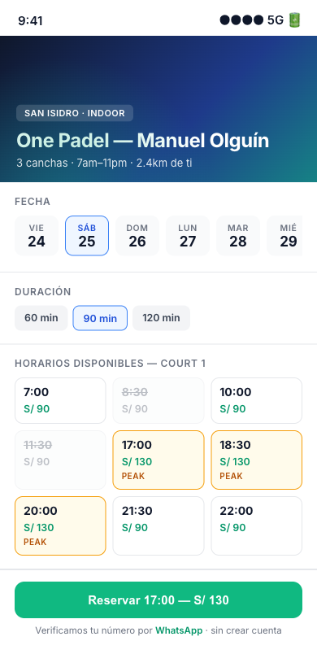

# PadelHub

**The operating system for padel courts in Peru.** A two-sided platform for
the booming Lima padel scene: a directory and booking flow for players, plus
a facility-management dashboard for court owners. Live at
**[padelhub.pe](https://padelhub.pe)** — 13 courts and counting.

<p align="center">
  
</p>

---

## Why

Padel exploded in Lima over the last two years. The infrastructure did not
catch up: players juggle WhatsApp groups to find a court with an open slot,
court owners run their calendars on paper, and nobody has a single source of
truth. Two pain points, one network:

- **Players** — fragmented discovery, no way to see availability across
  venues, and "find me 3 more players" is a group-chat exercise.
- **Court owners** — manual bookings, inevitable no-shows, no analytics, and
  a customer base that stops at their WhatsApp contacts.

PadelHub flips that into a network: more courts attract more players, more
players attract more courts, and the "open match" feature adds social
discovery that single-venue apps cannot replicate.

---

## What it is

Five applications in a single Turborepo, all TypeScript, sharing tRPC,
Drizzle schemas, auth, email, images, and WhatsApp packages.

| App | Stack | What it does |
|-----|-------|--------------|
| **Landing** | Astro 5 (static + one React island) | Public marketing site and facility-owner lead generation (`padelhub.pe`) |
| **Public Bookings** | Next.js 16 | Player-facing booking flow at `bookings.padelhub.pe/[facilitySlug]` — no account required, WhatsApp OTP verification |
| **Owner Dashboard** | Next.js 16 | Facility management, calendar, reservations, pricing, team RBAC |
| **Admin Panel** | Next.js 16 | Internal PadelHub ops — approve access requests, manage organizations |
| **Mobile App** | Expo (iOS + Android) | Player app for discovery, booking, and open-match coordination |

<table>
<tr>
<td align="center"><b>Owner dashboard — day view</b></td>
<td align="center"><b>Public booking — slot selection</b></td>
</tr>
<tr>
<td></td>
<td></td>
</tr>
</table>

---

## Stack

- **Runtime** — Node 22, pnpm 10 workspaces, Turborepo
- **Web** — Next.js 16 (App Router), Astro 5, React 19, Tailwind CSS v4,
  shadcn/ui, TanStack Query + Table, React Hook Form, Zod v4
- **Mobile** — Expo (iOS + Android), NativeWind v5
- **API** — tRPC v11 across all apps, shared router package
- **Data** — Supabase (Postgres) via Drizzle ORM; Cloudflare Images for
  photo storage; Upstash Redis for OTP + rate limiting (with an in-memory
  fallback for local dev)
- **Auth** — Better Auth for dashboard/admin; guest booking via Kapso
  WhatsApp OTP plus HMAC-signed phone tokens in `localStorage`
- **Email** — React Email + Resend (dev mode logs to console when no API key)
- **Bot protection** — Cloudflare Turnstile on the public booking flow
- **Testing** — Vitest, 661 co-located unit tests across `packages/` and
  `apps/nextjs/`
- **Deploy** — Vercel (web apps + Astro adapter), Expo EAS (mobile)

---

## Architectural choices worth flagging

These are deliberate and constrain the codebase:

- **Multi-tenant by design.** `Organization → OrganizationMember →
  Facility → Court → Booking` is the spine. Every facility-scoped router
  runs through a single `verifyFacilityAccess(ctx, facilityId, permission)`
  helper — no ad-hoc checks.
- **RBAC with facility scoping.** `org_admin` / `facility_manager` /
  `staff` across seven permissions, with a `facilityIds[]` array per
  membership to scope staff to specific venues. Documented matrix in the
  access-control module, exercised by 104 tests.
- **Guest booking without accounts.** Players book by phone, verified via
  a WhatsApp OTP (Kapso AUTHENTICATION template, 10-minute TTL, 5-attempt
  ceiling). Success mints an HMAC-signed token stored in `localStorage`
  for 30 days — subsequent bookings on the same device skip OTP.
- **On-access booking status transitions.** `confirmed → in_progress →
  completed` is a pure function of (now, startTime, endTime), resolved
  and persisted on every read rather than driven by a scheduler. No cron,
  no drift, no stale badges.
- **Pure schedule/pricing utilities.** `getTimeZoneWithMarkup`,
  `getRateForSlot`, `getAvailableSlots` are pure functions with no DB
  dependency. Consumed by both the owner dashboard (for internal booking)
  and the public booking app (for player-facing availability), guaranteed
  to produce the same answer.
- **Co-located package tests.** Tests live next to the code under
  `packages/*/src/__tests__/`, not in a separate `/tests` tree. Factory
  helpers (`makeMembership()`, `makeBooking()`) keep fixtures compact.

---

## Monorepo layout

```
apps/
  nextjs/            Court owner dashboard (port 3000)
  admin/             PadelHub internal admin (port 3001)
  bookings/          Public booking page (port 3002)
  landing/           Astro marketing site (port 4321)
  expo/              Player mobile app

packages/
  api/               tRPC v11 routers and access control
  auth/              Better Auth config + CLI
  db/                Drizzle schema + seed
  email/             React Email templates + Resend senders
  images/            Cloudflare Images integration
  ui/                Shared shadcn/ui components
  validators/        Shared Zod schemas
  whatsapp/          Kapso OTP + notification SDK

tooling/             ESLint, Prettier, Tailwind, TypeScript configs
```

Cross-cutting code lives in packages. Each app owns its own UI and
routing but depends on the shared `@wifo/api` router for server logic.

---

## Running it locally

Prerequisites: Node 22+, pnpm 10+, Docker Desktop, Supabase CLI.

```bash
pnpm install
cp .env.example .env            # defaults work for local dev
pnpm supabase:start             # local Postgres + Studio at :54323
pnpm db:push                    # push Drizzle schema
pnpm auth:generate              # generate Better Auth tables
pnpm db:seed                    # seed 3 facilities, 9 courts, 17 bookings
pnpm dev:next                   # dashboard at http://localhost:3000
```

Seeded accounts: `owner@padelhub.pe` / `manager@padelhub.pe` /
`staff@padelhub.pe` (all with password `password123`).

The other apps run independently:

```bash
pnpm dev:admin                  # admin panel :3001
pnpm dev:bookings               # public booking :3002
pnpm dev:landing                # astro landing :4321
```

---

## Testing

```bash
pnpm test                       # all Vitest suites — 661 unit tests
pnpm typecheck                  # TypeScript across the monorepo
pnpm lint                       # ESLint
```

Coverage spans the API router (access control, booking, calendar, pricing,
public booking, OTP, verification tokens), schedule utilities, slot
generation, slugify, WhatsApp package, Cloudflare Images, and a handful
of Next.js hooks. Factory helpers keep tests compact and signal-dense.

---

## Status

Live today:

- **[padelhub.pe](https://padelhub.pe)** — Astro landing + directory of
  13 courts across 6 Lima districts. Current directory surfaces WhatsApp
  deep links to each venue while the full booking flow is in private beta
  with early partner courts.

In production-but-gated:

- Owner dashboard — onboarded facilities manage courts, schedule, pricing,
  and bookings.
- Public booking — phone-verified guest booking at
  `bookings.padelhub.pe/[facilitySlug]`.
- WhatsApp booking confirmations via Kapso.

Built but not yet public:

- Expo mobile app (player-facing discovery + open matches).
- Admin panel workflows for approving new facilities.

---

## License

ISC
